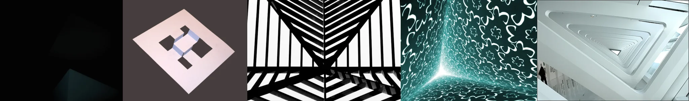

# Sample Debug Log

- turn: 54
- timestamp: 2026-02-25T14:51:16

## LLM Description

Sampled impossible geometry/illusions: (1) mostly dark shadow frame; (2) 3D rendered impossible staircase/Greek key impossible figure on gray background; (3) black and white striped op-art creating impossible triangle/volume illusion; (4) teal corridor with repeating cloud/shamrock flocking pattern creating vortex converging depth; (5) looking up into white triangular architectural staircase void with converging perspectives.
