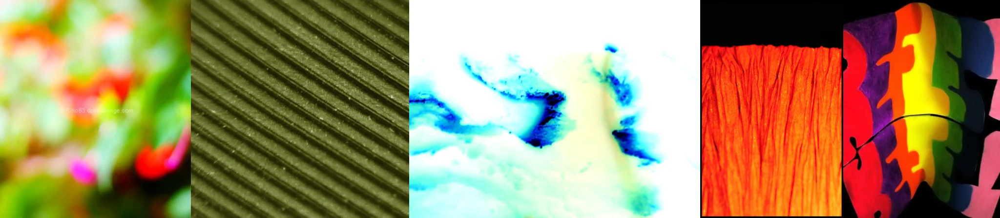

# Sample Debug Log

- turn: 14
- timestamp: 2026-02-25T19:20:21

## LLM Description

Photos vibrant采样：1) 模糊绿色红色散景背景 2) 深绿色波浪纹理表面 3) 青蓝水彩流动效果高对比 4) 橙红色纹理表面岩石/织物 5) 彩虹色块色谱排列。内容多样，从抽象到自然纹理，色彩饱和度较高。符合vibrant定义。
