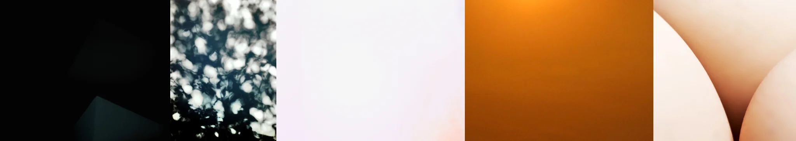

# Sample Debug Log

- turn: 25
- timestamp: 2026-02-25T19:26:15

## LLM Description

Subsurface scattering photos采样：暗部打火机微光、光斑树叶透光效果、柔和白/粉渐变、橙色发光球体、皮肤/肉体曲面透光效果。展示次表面散射特征：半透明表面内部发光。其中树叶光斑和皮肤图像最符合专业透光效果定义。
