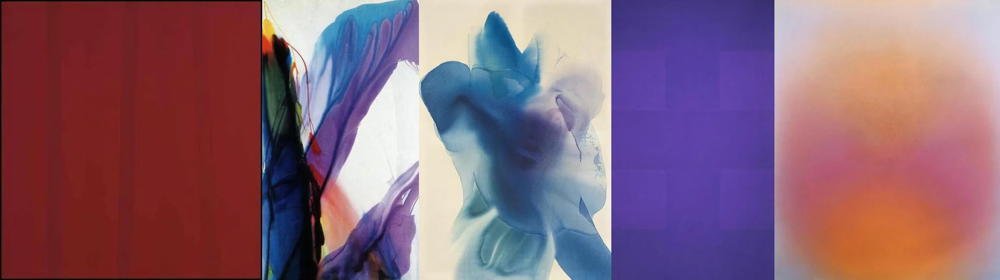

# Sample Debug Log

- turn: 27
- timestamp: 2026-02-25T19:27:18

## LLM Description

Subsurface scattering artwork采样：深红色平块色块、抽象幽灵水彩漂染、米色背景浅蓝漩漲形体、繊紫色繳面渐变、橙粉柔和渐变幕布。主要为水彩漂柒涂料的透光效果，符合subsurface scattering艺术表现定义。
