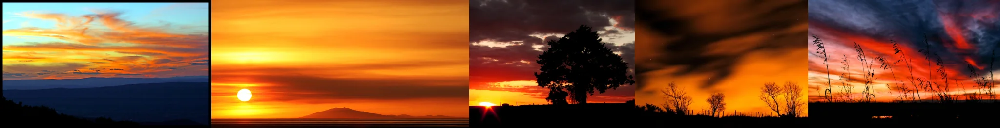

# Sample Debug Log

- turn: 36
- timestamp: 2026-02-25T19:33:25

## LLM Description

Sunset silhouette photography采样：多幅戏剧性日落景观——橙红渐变云彩与深蓝天空对比；太阳低垂于海平面上方；大树全景剪影对落日；流动云彩长曝光效果；芦苇草前景的紫红色天空。均展示专业级色调分离和光影对比，典型的cinematic color grading效果。
