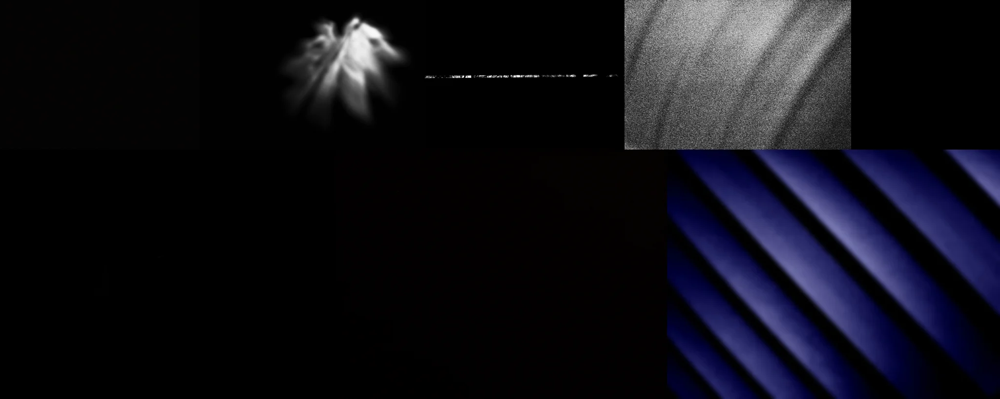

# Sample Debug Log

- turn: 10
- timestamp: 2026-02-25T21:40:40

## LLM Description

Chiaroscuro samples display extremely high-contrast minimalist compositions: near-black backgrounds with isolated sculptural light elements including a glowing white wing-like form at center, thin horizontal light strip, diagonal textured gradients, and slanted blue shadow stripes. Light emerges as discrete elements from darkness.
