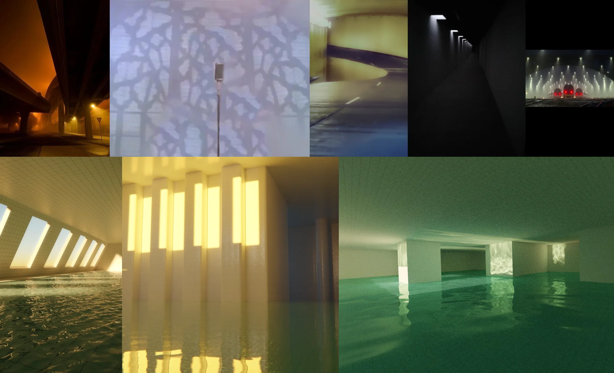

# Sample Debug Log

- turn: 12
- timestamp: 2026-02-25T21:46:39

## LLM Description

Dreamcore volumetric samples show surreal atmospheric lighting: warm orange light under industrial architecture, tree shadow projections through fog onto lavender surface, dark corridor with sequential ceiling lights, green-lit flooded rooms with reflections, tunnel with red tail lights and white spotlights. Light creates haze and volume in mist/water, evoking liminal spaces.
