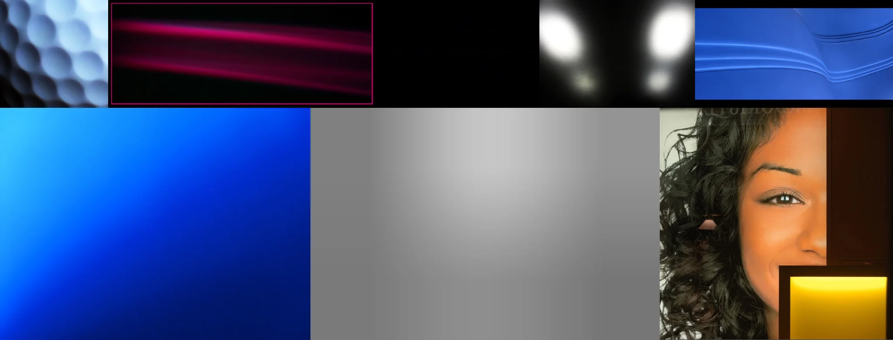

# Sample Debug Log

- turn: 14
- timestamp: 2026-02-25T21:47:44

## LLM Description

Rim lighting samples show mixed results: white spherical geometric patterns, pink diagonal light streak with red border, pure black background with two soft white glow spots, blue wave-like light trails, flat color gradients (blue and gray-white), and partial portrait. Contains abstract light effects and plain backgrounds of varying relevance to rim lighting concept.
