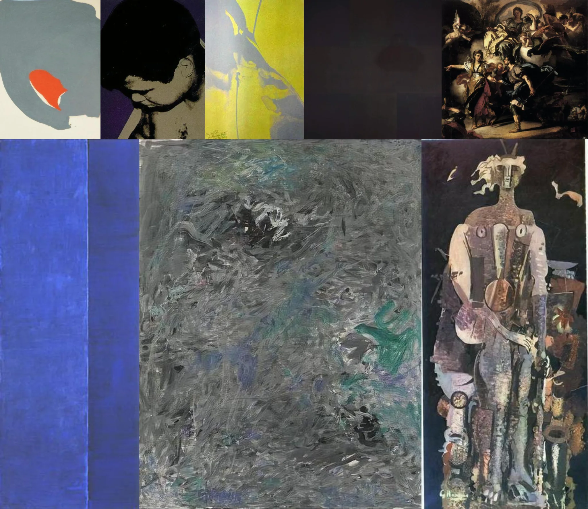

# Sample Debug Log

- turn: 16
- timestamp: 2026-02-25T21:48:37

## LLM Description

Artwork chiaroscuro samples show diverse interpretations: classical oil painting with dramatic multi-figure scene and strong light-shadow contrasts, high-contrast black-and-white portrait (Che Guevara style), abstract yellow-gray composition, monochrome blue panels, Cubist/collage-style standing figure with facial elements, and textured gray abstract painting. Mix of traditional chiaroscuro and modern abstract approaches.
