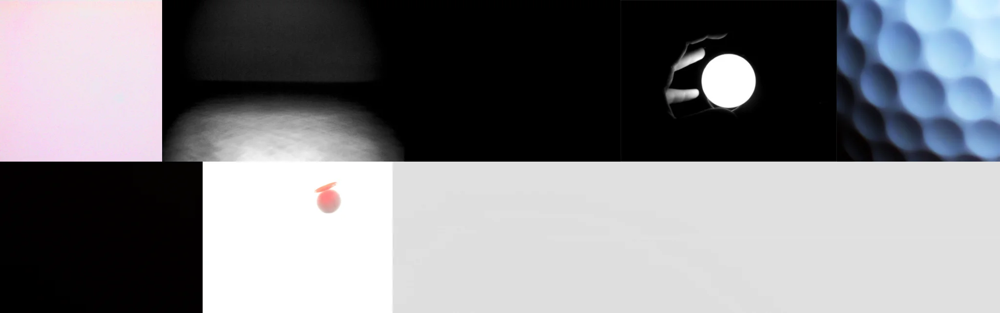

# Sample Debug Log

- turn: 18
- timestamp: 2026-02-25T21:51:03

## LLM Description

Global illumination samples show varied content: softly-lit spherical forms with gentle gradients suggesting bounce lighting, hand silhouetted against bright circular source, blue hexagonal cellular pattern, motion-blurred red object on white, and minimal color gradients.
