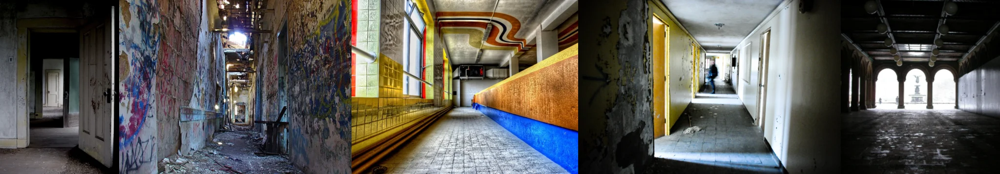

# Sample Debug Log

- turn: 5
- timestamp: 2026-02-25T14:54:47

## LLM Description

SAMPLE 1 (liminal public space): Shows five abandoned institutional hallways - decaying corridor with graffiti and peeling paint; narrow alleyway with debris; brightly lit corridor with retro yellow/blue tile patterns; curved hallway with arched openings; another industrial corridor. Strong anti-aesthetic qualities through decay, emptiness, and institutional monotony. Need to rate aesthetics and commit this batch.
