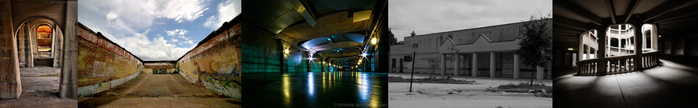

# Sample Debug Log

- turn: 8
- timestamp: 2026-02-25T14:57:40

## LLM Description

SAMPLE 2 (parking garages): Shows five empty concrete structures - arched stone corridor with warm lighting; open-air parking with graffiti-covered yellow walls; underground tunnel with green-blue lighting and reflections; deserted strip mall/commercial building exterior; rooftop parking deck with white balustrades. Strong liminal qualities through emptiness, artificial lighting, and abandonment. Some are more artistic but maintain anti-aesthetic emptiness.
