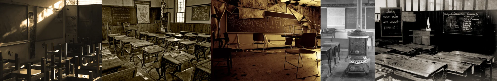

# Sample Debug Log

- turn: 13
- timestamp: 2026-02-25T15:01:30

## LLM Description

SAMPLE 3 (abandoned classrooms): Five sepia-toned and color images showing rows of vintage wooden school desks, old cast iron stoves, chalkboards with faded writing, peeling walls, dust motes in light beams, and scattered chairs. Anti-aesthetic through decay, abandonment, and lost time - once functional childlike spaces now desolate. High candidate count (9 at 0.5+ threshold) indicates limited pool, but quality images.
