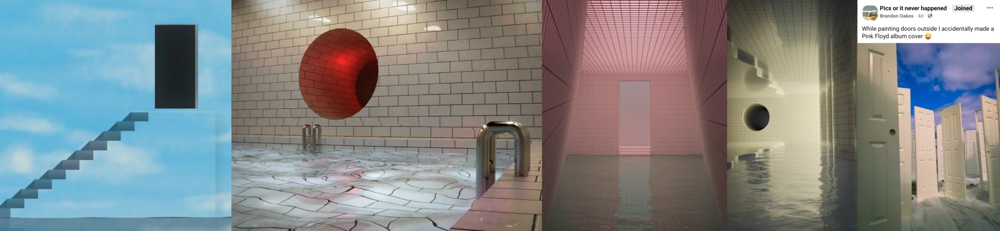

# Sample Debug Log

- turn: 17
- timestamp: 2026-02-25T15:03:37

## LLM Description

SAMPLE 5 (dreamcore floating objects): Five surreal digital/3D renders showing isolated architectural elements in voids - black doorway floating above staircase ascending into blue sky; white tile poolroom with cracked floor water and red sphere embedded in wall; pink-tiled corridor with white door at end; flooded beige corridor with circular openings; row of white doors standing in water under cloudy sky. One image contains social media text overlay. Anti-aesthetic through dreamlike disconnection and surreal symbolism.
