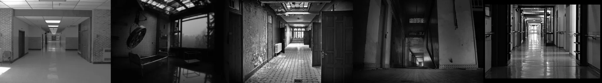

# Sample Debug Log

- turn: 24
- timestamp: 2026-02-25T15:10:40

## LLM Description

SAMPLE 6 (hospital corridors): Five black and white images showing long empty institutional corridors - clean linoleum hallway with brick walls and chair; dark room with surgical light abandoned equipment; decaying corridor with patterned tile floor and peeling door frames; stairwell descending with handrails; pristine corridor with reflective floor. Some contain equipment/people in distance but maintain liminal medical institutional atmosphere. Anti-aesthetic through institutional sterility and abandonment. Only 8 candidates at this threshold - lower than expected.
