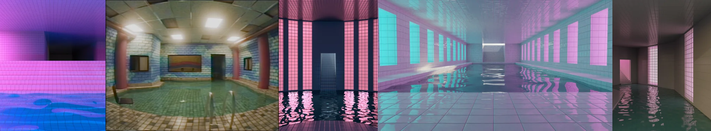

# Sample Debug Log

- turn: 26
- timestamp: 2026-02-25T15:11:16

## LLM Description

SAMPLE 7 (poolrooms): Five dreamcore-style 3D rendered images showing flooded or submerged interior pool spaces - pixelated pink/blue water surface with grid pattern; empty tiled pool room with red columns and landscape picture; pink-lit corridor with tiled columns reflected in water; long corridor with turquoise windows in purple/blue space; pink-lit room with water covering floor extending to doorway. Classic poolcore aesthetic with liminal anti-aesthetic qualities.
