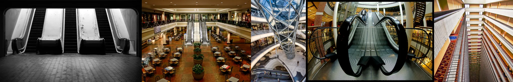

# Sample Debug Log

- turn: 28
- timestamp: 2026-02-25T15:12:01

## LLM Description

SAMPLE 8 (abandoned malls): Five images of large commercial interiors - black and white empty escalators at bottom of frame; populated atrium with tables (rejected for anti-aesthetic goal?); modern glass dome atrium; dramatic curved escalators; extreme vertical view down open atriums. Some show occasional people but emphasize empty architectural space. Anti-aesthetic through grand scale emptiness. Only 9 candidates at this threshold - tight match.
