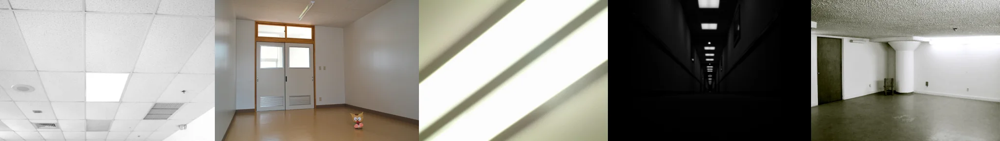

# Sample Debug Log

- turn: 30
- timestamp: 2026-02-25T15:12:45

## LLM Description

SAMPLE 9 (sterile rooms): Five minimalist institutional spaces - dropped ceiling tiles with fluorescent lights; white room with wooden flooring containing small cat statue; abstract diagonal light beams on wall; dark corridor with ceiling lights creating tunnel effect; hallway with polished floor and green door. Anti-aesthetic through sterility, emptiness, and bland functionality. Uncanny quality from lone object in empty space.
