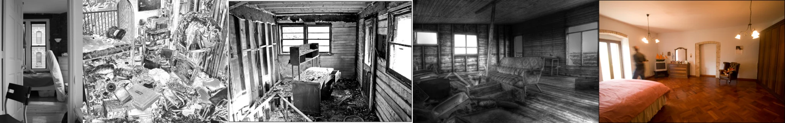

# Sample Debug Log

- turn: 36
- timestamp: 2026-02-25T15:20:26

## LLM Description

SAMPLE 10 (abandoned domestic): Five images showing domestic decay - sparse room with chair and window; extreme hoarder/mess room filled with debris; burned/damaged room with charred bed; weathered cabin interior with sofa; empty room with person blurred in motion. Anti-aesthetic through domestic disorder, decay, and abandonment. Some have high debris content. 12 candidates at this threshold.
