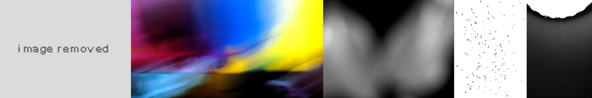

# Sample Debug Log

- turn: 8
- timestamp: 2026-02-25T14:03:19

## LLM Description

Underexposed sample images visible: 1) gray 'image removed' placeholder, 2) blurry abstract with oversaturated rainbow colors (yellow/blue/red gradients), 3) soft out-of-focus black and white blobs, 4) bright white overexposed area with black specks on gray gradient, 5) plain gray tone. Mixed results - some abstract/avant-garde rather than pure underexposed content. Need to check overexposed sample next.
