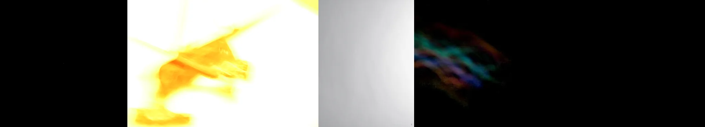

# Sample Debug Log

- turn: 10
- timestamp: 2026-02-25T14:03:42

## LLM Description

Overexposed sample images: 1) Extremely bright blown-out yellow-orange image with no visible detail, resembling fire or sun exposure, 2) Plain light gray gradient with minimal tonal variation, 3) Dark frame with colorful spectral streaks that seems misplaced (not overexposed). Only 2 out of 3 are genuinely overexposed. Threshold of 0.38-0.48 captures some valid cases but includes noise. Will proceed to rate aesthetics and commit with appropriate thresholds.
