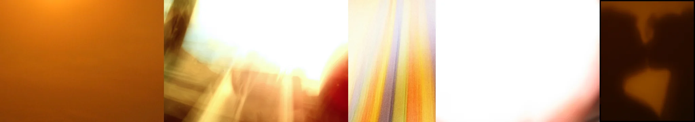

# Sample Debug Log

- turn: 18
- timestamp: 2026-02-25T14:06:50

## LLM Description

Light leak sample images: 1) Solid dark orange gradient resembling film fogging, 2) Extremely bright yellow-orange blow-out with light streaks washing out details, 3) Vertical orange/purple/white iridescent streaks - classic film light leak artifact, 4) Near-white overexposed frame with edge bleeding, 5) Dark orange-black shadow with warm color cast. All show authentic film defect aesthetics - orange/yellow color casts, streaks, and overexposed areas from light leaking into camera body.
