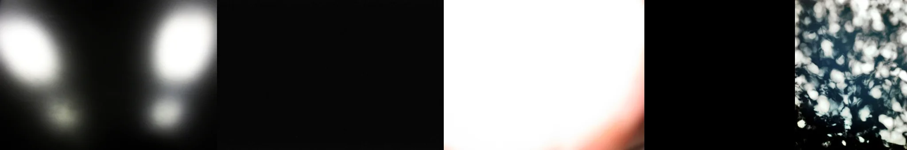

# Sample Debug Log

- turn: 20
- timestamp: 2026-02-25T14:07:48

## LLM Description

Harsh flash sample images: 1) Blurry car headlights against black background, 2) Completely black frame (no light), 3) Extreme overexposure - almost pure white with red edge bleed, 4) Completely black frame, 5) Dappled sunlight through leaves (not harsh flash). Mixed quality - some legitimate harsh flash/overexposure, some misses. Will use lower threshold to capture the genuine harsh flash content.
