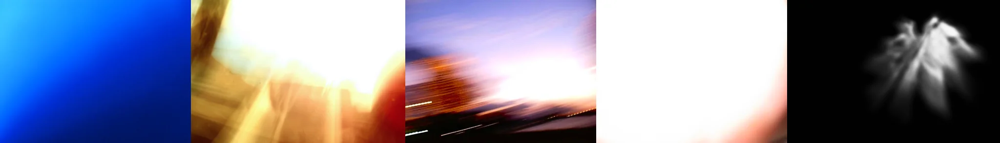

# Sample Debug Log

- turn: 28
- timestamp: 2026-02-25T14:11:43

## LLM Description

Lens flare sample images: 1) Solid blue gradient (not lens flare, likely false positive), 2) Blurred golden-yellow extreme overexposure with light streaks washing out details, 3) Motion-blurred sunset with blown out sun and city lights, motion trails, 4) Severe overexposure from right edge creating white burn with gradient falloff, 5) Monochrome ghost artifacts with light rays radiating outward. Images 2, 3, 4, 5 show authentic lens flare artifacts and overexposure effects.
