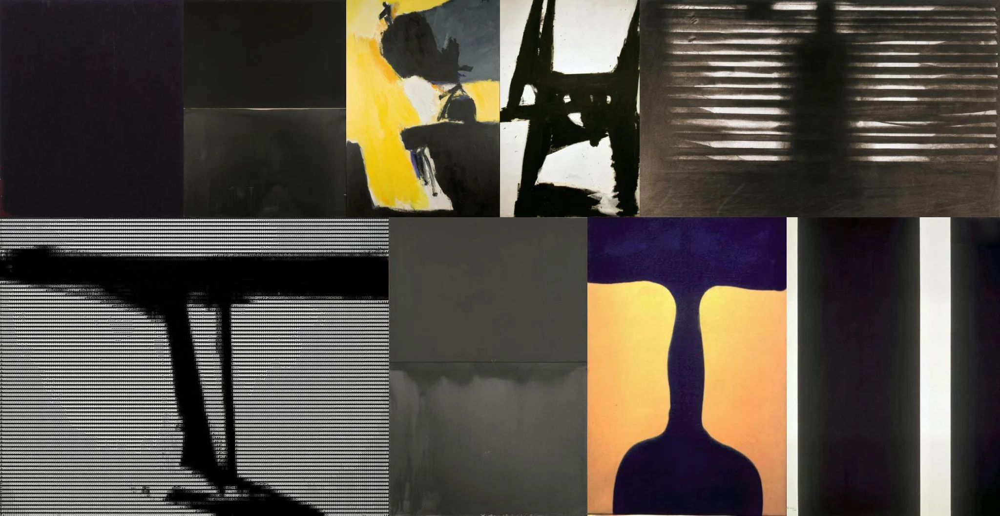

# Sample Debug Log

- turn: 38
- timestamp: 2026-02-25T14:16:41

## LLM Description

Artwork silhouette samples: Collection of abstract expressionist paintings featuring extreme chiaroscuro. 1) Yellow field with black silhouette-like forms, 2) Black ink brushstrokes on white ground, 3) Horizontal striations creating shadow effects, 4) Purple/orange complementary color blocks with dark silhouette shape resembling a vase, 5) Horizontal line-scan effect with dark forms. Strong tonal extremes, dramatic contrasts between light and dark areas, minimal midtones - excellent anti-aesthetic examples.
