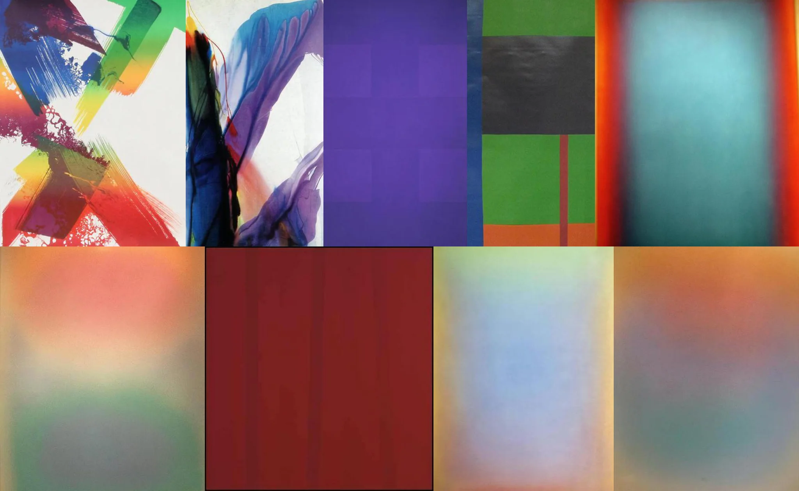

# Sample Debug Log

- turn: 40
- timestamp: 2026-02-25T14:17:43

## LLM Description

Oversaturated artwork samples: Color field paintings and abstract expressionist works with intense saturation. 1) Rainbow gestural brushstrokes (red/yellow/green/blue) on white ground with splatter effects, 2) Dark blue gestural strokes with color bleeding, 3) Solid ultra-violet color field, 4) Geometric blocks (green/black/orange/red), 5) Turquoise/cyan field with red/orange border - neon-like intensity. Several pieces show posterization-like effects with posterized blocks of pure color, minimal gradients - classic oversaturated aesthetic.
