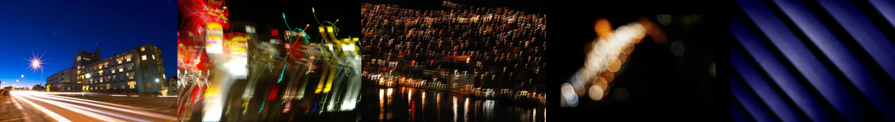

# Sample Debug Log

- turn: 49
- timestamp: 2026-02-25T14:21:13

## LLM Description

Motion blur samples: 1) Long exposure night street with car light trails streaking across frame, starburst streetlight, buildings, 2) Extreme chaotic camera shake with multiple light sources creating tangled neon trails, extreme motion blur resulting in abstract colorful lines, 3) Urban night waterfront with dense building lights reflected, slight blur creating softened glow, 4) Extreme defocus creating circular bokeh patterns against dark background, 5) Diagonal blue gradient stripes with motion streak effect. Images 1, 2, 3 show intentional/accidental motion blur; image 4 is defocus bokeh; image 5 is gradient.
