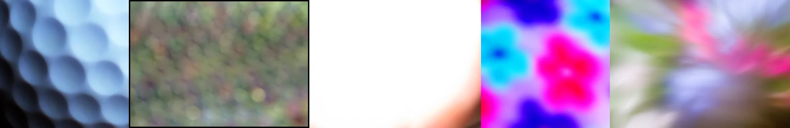

# Sample Debug Log

- turn: 51
- timestamp: 2026-02-25T14:21:43

## LLM Description

Defocused blur samples: 1) Radial honeycomb/macro bokeh pattern with semicircular gradients in blue/white tones, 2) Out-of-focus foliage background with soft green/brown bokeh circles, 3) Severely overexposed white gradient with slight pink tint - field of pure light, 4) Extreme oversaturated pink and cyan psychedelic bokeh resembling flowers or abstract color blobs, 5) Blurry park scene with green trees and pink flowers, soft defocus creating impressionistic effect. Mix of intentional defocus, extreme bokeh, and extreme overexposure.
