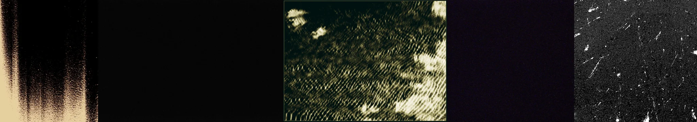

# Sample Debug Log

- turn: 57
- timestamp: 2026-02-25T14:24:32

## LLM Description

Film grain samples: 1) Analog film edge with heavy sepia-toned grain, vertical gradient from cream to black, 2) Near-black frame with minimal visible content, 3) Heavy interlaced noise pattern creating moiré effect, dark greenish tone with light dappled patches, 4) Very dark purple-black flat tone, 5) Black and white grain texture with white scratch marks and dust specks. These show analog film degradation, high ISO digital noise, and analog artifacts - excellent technical quality degradation content for anti-aesthetic dataset.
