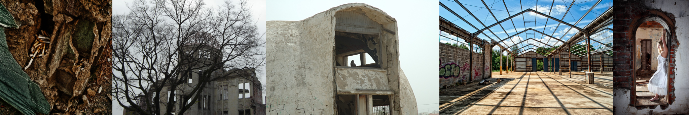

# Sample Debug Log

- turn: 6
- timestamp: 2026-02-16T14:18:40

## LLM Description

采样图片观察（collapsed building ruins）：
1. 岩石纹理局部特写，带白色老虎图案
2. 冬季枯树前的废弃多层建筑，部分窗户破损
3. 严重风化的混凝土圆形建筑结构，墙面斑驳
4. 废弃工业仓库内部，钢梁框架，地面涂鸦，蓝天透入
5. 拱门形石质废墟结构，室内光线昏暗

候选数1048表明有大量匹配图片。接下来进行美学评分来确认阈值选择。
