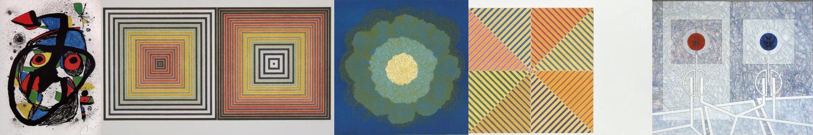

# Sample Debug Log

- turn: 9
- timestamp: 2026-02-16T03:30:08

## LLM Description

**Sampled Images Content (Artwork Dataset)**
- Image 1: Abstract Miro-style painting with anthropomorphic figures, primary colors (red, blue, yellow, black), splatter technique
- Image 2: Two concentric square patterns (op art style) with rainbow gradient color progression from center outward
- Image 3: Circular floral/radial design with layered blue-green petals and yellow center on blue field
- Image 4: Geometric grid of four squares with diagonal striped patterns in yellow, pink, blue, creating optical illusion
- Image 5: Blueprint-style geometric drawing with two vertical totem-like structures featuring red and blue circles, network of fine lines

**Observation**: Artwork samples lean more toward op art and geometric abstraction than traditional psychedelic art; similarity threshold should be calibrated carefully.
